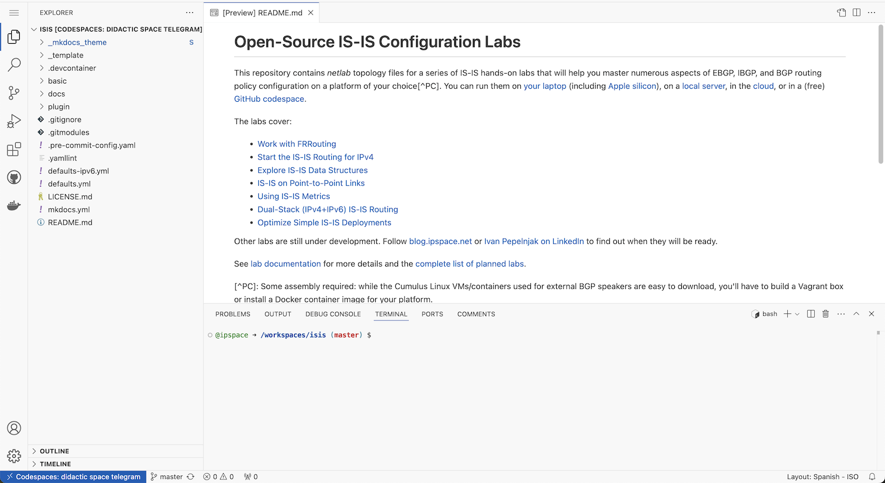

# Use GitHub Codespaces

You can run VXLAN/EVPN labs in (free[^UTAP]) [GitHub codespaces](https://docs.github.com/en/codespaces/overview); all you need is a GitHub account:

* [Create a new codespace for your VXLAN/EVPN labs](https://github.com/codespaces/new/bgplab/evpn){:target="_blank"} or [connect to an existing codespace](https://github.com/codespaces){:target="_blank"}.
* Unless you're using GitHub codespaces with VS Code (in which case you know what to do), your codespace opens in a new browser window with three tabs: Explorer (repository folders), Preview (starting with README), and Terminal.

[^UTAP]: You get 120 free core hours per month or [pay for more](https://docs.github.com/en/billing/managing-billing-for-github-codespaces/about-billing-for-github-codespaces).

[](img/codespaces-start.png)

## Select Lab Devices

GitHub Codespaces can run only "true" containers (not virtual machines packaged as containers) and cannot load additional Linux kernel modules. You can thus choose only between Arista cEOS and Nokia SR Linux containers (FRRouting and VyOS containers require the VXLAN kernel module).

The VXLAN/EVPN labs repository uses Arista cEOS containers as the default device. You can change that with the `netlab defaults --project device=_value_` command executed in the top directory (where the terminal window opens) or edit the `defaults.yml` file with a text editor like `vi` or `nano`.

For example, the following command changes the user lab devices to SR Linux (the only other device you can use as a VXLAN/EVPN switch with GitHub Codespaces):

```shell
$ netlab defaults --project device=srlinux
The default setting device is already set in project defaults
Do you want to change that setting in project defaults [y/n]: y
device set to srlinux in /home/user/evpn/defaults.yml
```

**Notes:**

* You will have to [download the Arista cEOS container](https://www.arista.com/en/support/software-download) (registration required) and [copy it into your GitHub codespace](https://blog.ipspace.net/2024/07/arista-eos-codespaces/).
* Nokia SR Linux container is published in a public repository and can be downloaded automatically.

## Start a Lab

Once you have the codespaces up and running:

* Click on the desired lab exercise in the README.md preview window to select the exercise folder.
* Right-click on the exercise folder and select "*Open in Integrated Terminal*" to launch a **bash** session in the desired directory.
* Execute **netlab up** to start the lab.
* Expand the exercise folder in the Explorer tab.
* Right-click on the `README.md` file and select "_Open Preview_" to open the rendered version of the file.
* Click the link in the README.md file to get the exercise description in the preview pane.
* Connect to your devices with the **netlab connect** command executed in the Terminal pane.

[](img/codespaces-lab.png)

## Cleanup and Shutdown

Finally, don't forget to shut down the lab with **netlab down** and stop your codespace after you're done:

* Click on the blue "*Codespaces*" button in the bottom-left corner of the browser window.
* Select "*Stop Current Codespace*". You should also adjust *idle timeout* and *default retention period* in [your codespaces settings](https://github.com/settings/codespaces).