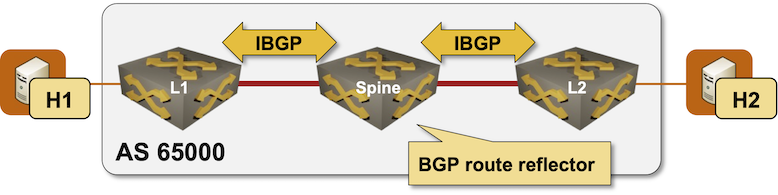

# BGP Route Reflectors in EVPN Fabrics

BGP was designed to be used with a full mesh of IBGP sessions within an autonomous system. That's clearly an impossible requirement as soon as your network is larger than a few nodes, and we've been using [BGP route reflectors](https://bgplabs.net/ibgp/3-rr/) as a scalability mechanism for decades.

EVPN fabrics are no different; we typically deploy BGP route reflectors on spine routers when running EVPN in large leaf-and-spine fabrics. That's exactly what you'll be doing in this lab exercise.



### Device Requirements {#req}

You can use any device supported by the _netlab_ [OSPF](https://netlab.tools/module/ospf/#platform-support), [BGP](https://netlab.tools/module/bgp/#platform-support), and [VLAN](https://netlab.tools/module/vlan/#platform-support) configuration modules. _netlab_ will also try to configure EVPN and VXLAN on your devices.

## Start the Lab

Assuming you already [set up your lab infrastructure](../1-setup.md):

* Change directory to `design/1-rr`
* Execute **netlab up**
* Log into lab devices with **netlab connect** and verify that the IP addresses and OSPF and BGP routing protocols are properly configured.

## Existing Device Configuration

* The switches in your lab (S1 and S2) are preconfigured with a *tenant* VLAN with VLAN tag 100.
* IPv4 addresses are configured on Linux hosts, switch loopback interfaces, and the interswitch links ([details](#addr)).
* The switches run OSPF in area 0 across the interswitch links ([details](#ospf)).
* The leaf switches have IBGP sessions with the spine switch. The spine switch is a BGP route reflector ([details](#bgp)). 
* The IBGP sessions are currently configured to exchange IPv4 prefixes.

## Configuration Tasks

_netlab_ will try to configure EVPN and VXLAN on the leaf switches, but if it can't do that, use the procedure you've mastered in the [Extend a Single VLAN Segment with VXLAN](../vxlan/1-single.md) lab exercise to configure VTEPs and EVPN MAC-VRFs on the leaf switches.

After your devices have VXLAN and EVPN MAC-VRF configurations:

* Enable EVPN address family (AF) on all IBGP sessions
* Once you've enabled EVPN AF on IBGP sessions, you can deactivate IPv4 AF (the paths toward switch loopback interfaces are calculated with OSPF)
* Configure the spine switch to be a route reflector (RR) for the EVPN address family

!!! tip
    Most devices require the RR configuration for each address family. If your device applies the RR configuration to all address families, you'll have a running network as soon as you enable EVPN AF on IBGP sessions.

## Verification

Try to ping h2 from h1:

```
$ netlab connect h1 ping h2
Connecting to container clab-single-h1, executing ping h2
PING h2 (172.16.0.4): 56 data bytes
64 bytes from 172.16.0.4: seq=0 ttl=64 time=5.273 ms
64 bytes from 172.16.0.4: seq=1 ttl=64 time=2.048 ms
^C
--- h2 ping statistics ---
2 packets transmitted, 2 packets received, 0% packet loss
round-trip min/avg/max = 2.048/3.660/5.273 ms
```

Done? Let's see what happens when you want to [run EVPN over EBGP](2-ebgp.md).

## Troubleshooting {#tshoot}

Apart from using the usual [troubleshooting hints](../vxlan/1-single.md#tshoot) from the [Extend a Single VLAN Segment with VXLAN](../vxlan/1-single.md) lab exercise, verify that:

* EVPN routes (for example, the IMET routes) are propagated between the leaf switches (L1 → spine → L2)
* The EVPN routes on the remote leaf switch have the exact same content as the routes on the originating switch.

For example, this is the IMET route originated by L1 as seen on L1:

EVPN IMET route displayed on the originating router (L1 running Arista cEOS)
{.code-caption}
```
l1#show bgp evpn route-type imet 10.0.0.2 detail
BGP routing table information for VRF default
Router identifier 10.0.0.2, local AS number 65000
BGP routing table entry for imet 10.0.0.2, Route Distinguisher: 10.0.0.2:100
 Paths: 1 available
  Local
    - from - (0.0.0.0)
      Origin IGP, metric -, localpref -, weight 0, tag 0, valid, local, best
      Extended Community: Route-Target-AS:65000:100 TunnelEncap:tunnelTypeVxlan
      VNI: 1000
      PMSI Tunnel: Ingress Replication, MPLS Label: 1000, Leaf Information Required: false, Tunnel ID: 10.0.0.2
```

This is the same route inspected on the remote leaf switch (L2). The only differences in the BGP attribute are RR-specific attributes (*Originator* and *Cluster list*)

EVPN IMET route displayed on the originating router (L1 running Arista cEOS)
{.code-caption}
```
BGP routing table information for VRF default
Router identifier 10.0.0.3, local AS number 65000
BGP routing table entry for imet 10.0.0.2, Route Distinguisher: 10.0.0.2:100
 Paths: 1 available
  Local
    10.0.0.2 from 10.0.0.1 (10.0.0.1)
      Origin IGP, metric -, localpref 100, weight 0, tag 0, valid, internal, best
      Originator: 10.0.0.2, Cluster list: 10.0.0.1
      Extended Community: Route-Target-AS:65000:100 TunnelEncap:tunnelTypeVxlan
      VNI: 1000
      PMSI Tunnel: Ingress Replication, MPLS Label: 1000, Leaf Information Required: false, Tunnel ID: 10.0.0.2
```

## Cheating

* Shut down your lab with the **netlab down** command
* Start the lab from the `solution.yml` topology with the **netlab up solution.yml** command
* Explore the device configurations

## Reference Information

### Lab Wiring {#wiring}

| Origin Device | Origin Port | Destination Device | Destination Port |
|---------------|-------------|--------------------|------------------|
| l1 | Ethernet1 | spine | Ethernet1 |
| l2 | Ethernet1 | spine | Ethernet2 |
| h1 | eth1 | l1 | Ethernet2 |
| h2 | eth1 | l2 | Ethernet2 |

### Lab Addressing {#addr}

| Node/Interface | IPv4 Address | IPv6 Address | Description |
|----------------|-------------:|-------------:|-------------|
| **spine** |  10.0.0.1/32 |  | Loopback |
| Ethernet1 | 10.1.0.2/30 |  | spine -> l1 |
| Ethernet2 | 10.1.0.6/30 |  | spine -> l2 |
| **l1** |  10.0.0.2/32 |  | Loopback |
| Ethernet1 | 10.1.0.1/30 |  | l1 -> spine |
| **l2** |  10.0.0.3/32 |  | Loopback |
| Ethernet1 | 10.1.0.5/30 |  | l2 -> spine |
| **h1** |
| eth1 | 172.16.0.4/24 |  | h1 -> [l1,h2,l2] |
| **h2** |
| eth1 | 172.16.0.5/24 |  | h2 -> [h1,l1,l2] |

### OSPF Routing (Area 0) {#ospf}

| Router | Interface | IPv4 Address | Neighbor(s) |
|--------|-----------|-------------:|-------------|
| spine | Loopback | 10.0.0.1/32 | |
|  | Ethernet1 | 10.1.0.2/30 | l1 |
|  | Ethernet2 | 10.1.0.6/30 | l2 |
| l1 | Loopback | 10.0.0.2/32 | |
|  | Ethernet1 | 10.1.0.1/30 | spine |
| l2 | Loopback | 10.0.0.3/32 | |
|  | Ethernet1 | 10.1.0.5/30 | spine |

### BGP Routing {#bgp}

| Node | Router ID/<br />Neighbor | Router AS/<br />Neighbor AS | Neighbor IPv4 |
|------|------------------|---------------------:|--------------:|
| **spine** | 10.0.0.1 | 65000 |
| | l1 | 65000 | 10.0.0.2 |
| | l2 | 65000 | 10.0.0.3 |
| **l1** | 10.0.0.2 | 65000 |
| | spine | 65000 | 10.0.0.1 |
| **l2** | 10.0.0.3 | 65000 |
| | spine | 65000 | 10.0.0.1 |
