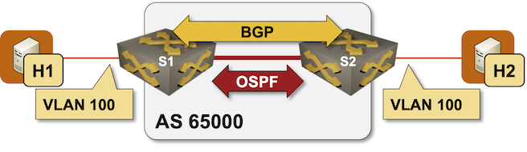

# Build an EVPN-based MAC-VRF instance

By completing the [VXLAN lab exercises](../index.md#vxlan), you learned how to configure the transport of Ethernet frames across an IP network. Those solutions lacked a control plane; you had to manually configure the remote VTEPs, and the VXLAN-based network relied on data-plane learning to establish the mapping between MAC addresses and VTEPs. In this lab exercise, you'll add EVPN control plane (another BGP address family) to the VXLAN network:



### Device Requirements {#req}

You can use any device supported by the _netlab_ [OSPF](https://netlab.tools/module/ospf/#platform-support), [BGP](https://netlab.tools/module/bgp/#platform-support), and [VLAN](https://netlab.tools/module/vlan/#platform-support) configuration modules. The device should support VXLAN and EVPN.

## Start the Lab

Assuming you already [set up your lab infrastructure](../1-setup.md):

* Change directory to `evpn/1-bridging`
* Execute **netlab up**
* Log into lab devices with **netlab connect** and verify that the IP addresses and OSPF and BGP routing protocols are properly configured.

## Existing Device Configuration

* The switches in your lab (S1 and S2) are preconfigured with a *tenant* VLAN with VLAN tag 100.
* IPv4 addresses are configured on Linux hosts, switch loopback interfaces, and the interswitch link ([details](#addr)).
* The switches run OSPF in area 0 across the interswitch link ([details](#ospf)).
* The switches have an IBGP session between their loopback interfaces. The IBGP session is currently configured to exchange IPv4 prefixes ([details](#bgp)).

## Configuration Tasks

Configuring a VXLAN segment with EVPN control plane is a multi-step process:

* Configure the VXLAN interface (VTEP) and map the VLAN 100 into VXLAN VNI 100100. Do not configure the ingress replication (flooding) list. You'll find the detailed instructions in the [Extend a Single VLAN Segment with VXLAN](../vxlan/1-single.md) lab exercise.
* Enable the EVPN address family on the IBGP session. This should be as simple as selecting the correct address family in the BGP configuration and activating the configured neighbors.
* Configure an EVPN MAC-VRF instance (the crux of this lab exercise).

!!! tip
    [RFC 7432](https://datatracker.ietf.org/doc/html/rfc7432) (BGP MPLS-Based Ethernet VPN) defines EVPN instances (independent MAC forwarding tables) and three types of EVPN instances (VLAN-based, VLAN bundle, and VLAN-aware bundle). [RFC 9469](https://datatracker.ietf.org/doc/html/rfc9469) (Applicability of Ethernet Virtual Private Network (EVPN) to Network Virtualization over Layer 3 (NVO3) Networks) redefines an EVPN instance as MAC-VRF.
    
    On most data center switches, it's easiest to configure VLAN-based MAC-VRFs; Junos is one of the few exceptions. We're not concerned with interoperability in this lab exercise; use the EVPN VLAN service that is easiest to configure.

The configuration of an EVPN MAC-VRF instance usually requires configuring three parameters:

* The EVPN *route targets* (RT) used to import/export MAC routes into/from the MAC-VRF instance. A good default value in simple deployments is `BGP-ASN:VLAN-ID`; in our network, that would be 65000:100.
* The MAC-VRF instance *route distinguisher* (RD) that makes the MAC-VRF routes globally unique. Each MAC-VRF instance should have a unique route distinguisher[^MPRD]; `VTEP-IP:VLAN-ID` is a good default.
* You usually have to tell the device that you want to use EVPN as the control-plane protocol for the VXLAN segment, and that you want the dynamically-learned MAC addresses redistributed into EVPN MAC/IP (type-1) routes.

[^MPRD]: We usually recommend using the same MPLS/VPN route distinguisher for a given (simple) VRF on all PE-routers. EVPN is different; you should use a unique RD for each VRF instance (different RDs for the same MAC-VRF on different PE devices).

The configuration details vary significantly across different EVPN implementations. On Arista EOS, you have to:

* Configure a VLAN within the BGP configuration
* Configure EVPN RT and RD within the BGP VLAN configuration
* Configure redistribution of *learned* routes into EVPN within the BGP VLAN configuration

FRRouting configuration is similar, but:

* Uses VNIs (not VLANs) to identify MAC-VRF instances within BGP configuration
* Specifies redistribution of MAC addresses into EVPN routes within the EVPN address family (applicable to all MAC-VRFs)

Nexus OS uses a completely different syntax:

* MAC-VRF instances are configured for VNI segments (not VLANs) under **evpn** configuration.
* The use of the EVPN control plane (to build ingress replication lists and learn MAC-to-VTEP mappings) is configured within the VXLAN interface configuration.

## Verification

Try to ping h2 from h1:

```
$ netlab connect h1 ping h2
Connecting to container clab-single-h1, executing ping h2
PING h2 (172.16.0.4): 56 data bytes
64 bytes from 172.16.0.4: seq=0 ttl=64 time=5.273 ms
64 bytes from 172.16.0.4: seq=1 ttl=64 time=2.048 ms
^C
--- h2 ping statistics ---
2 packets transmitted, 2 packets received, 0% packet loss
round-trip min/avg/max = 2.048/3.660/5.273 ms
```

Done? Let's do a [slightly more complex scenario](2-complex.md).

## Troubleshooting {#tshoot}

Use these troubleshooting steps if the Linux hosts can't communicate over the stretched VLAN segment:

!!! note
    The troubleshooting instructions use Arista EOS **show** commands and corresponding printouts. You'll need to find matching commands if you use a different platform.
    
    It's also highly recommended to follow the vendor's EVPN/VXLAN troubleshooting procedures; some of them tend to be quite good.

* Perform the basic troubleshooting steps from the [Extend a Single VLAN Segment with VXLAN](../vxlan/1-single.md) lab exercise.
* Check the IBGP session between S1 and S2 and verify that the EVPN address family is active:

```
s1#show bgp evpn summary
BGP summary information for VRF default
Router identifier 10.0.0.1, local AS number 65000
Neighbor Status Codes: m - Under maintenance
  Description              Neighbor V AS           MsgRcvd   MsgSent  InQ OutQ  Up/Down State   PfxRcd PfxAcc PfxAdv
  s2                       10.0.0.2 4 65000              7         9    0    0 00:00:03 Estab   1      1      1
```

* Some platforms allow you to check the control plane for the VXLAN segments:

```
s1#show vxlan control-plane
   VLAN       Control Plane       Direction    Source
---------- ------------------- --------------- -------------
   100        EVPN                both         configuration
```

* You should see the Inclusive Multicast Ethernet Tag (IMET; type-3) EVPN routes immediately after configuring the MAC-VRF instances. An IMET route should originate from a local switch, and another should be received from the IBGP neighbor. You misconfigured the MAC-VRF or forgot to configure RD/RT if you don't see the local IMET route. You probably forgot to activate the EVPN session if you can see the local one but not the remote one.

```
s1#show bgp evpn
BGP routing table information for VRF default
Router identifier 10.0.0.1, local AS number 65000
Route status codes: * - valid, > - active, S - Stale, E - ECMP head, e - ECMP
                    c - Contributing to ECMP, % - Pending best path selection
Origin codes: i - IGP, e - EGP, ? - incomplete
AS Path Attributes: Or-ID - Originator ID, C-LST - Cluster List, LL Nexthop - Link Local Nexthop

          Network                Next Hop              Metric  LocPref Weight  Path
 * >      RD: 10.0.0.1:100 imet 10.0.0.1
                                 -                     -       -       0       i
 * >      RD: 10.0.0.2:100 imet 10.0.0.2
                                 10.0.0.2              -       100     0       i
```

* The IMET routes should be used to configure the VXLAN flood lists. You misconfigured the VXLAN control plane (where applicable) or EVPN route targets if you can't see the remote VTEP.

```
s1#show vxlan vtep detail
Remote VTEPS for Vxlan1:

VTEP           Learned Via         MAC Address Learning       Tunnel Type(s)
-------------- ------------------- -------------------------- --------------
10.0.0.2       control plane       control plane              flood

Total number of remote VTEPS:  1
```

* You should see MAC/IP routes after trying to ping the remote Linux hosts. You probably forgot to configure the redistribution of dynamically-learned MAC prefixes into EVPN if you can't see the MAC/IP routes.

```
s1#show bgp evpn
BGP routing table information for VRF default
Router identifier 10.0.0.1, local AS number 65000
Route status codes: * - valid, > - active, S - Stale, E - ECMP head, e - ECMP
                    c - Contributing to ECMP, % - Pending best path selection
Origin codes: i - IGP, e - EGP, ? - incomplete
AS Path Attributes: Or-ID - Originator ID, C-LST - Cluster List, LL Nexthop - Link Local Nexthop

          Network                Next Hop              Metric  LocPref Weight  Path
 * >      RD: 10.0.0.1:100 mac-ip aac1.ab1e.f7d5
                                 -                     -       -       0       i
 * >      RD: 10.0.0.2:100 mac-ip aac1.ab47.43b2
                                 10.0.0.2              -       100     0       i
 * >      RD: 10.0.0.1:100 imet 10.0.0.1
                                 -                     -       -       0       i
 * >      RD: 10.0.0.2:100 imet 10.0.0.2
                                 10.0.0.2              -       100     0       i
```

* The remote MAC/IP routes should be present in the local MAC address table. You probably misconfigured (or forgot to configure) the EVPN route targets if you can see the EVPN MAC/IP routes, but they aren't present in the VLAN MAC address table.

```
s1#show mac address-table vlan 100
          Mac Address Table
------------------------------------------------------------------

Vlan    Mac Address       Type        Ports      Moves   Last Move
----    -----------       ----        -----      -----   ---------
 100    aac1.ab1e.f7d5    DYNAMIC     Et2        1       0:05:05 ago
 100    aac1.ab47.43b2    DYNAMIC     Vx1        1       0:05:05 ago
Total Mac Addresses for this criterion: 2
```

* When needed, use the **show bgp evpn detail** (or similar) command to inspect the details of individual EVPN routes. EVPN BGP tables can get pretty big; most vendors have **show** command options that you can use to select only the routes you're interested in:

```
s1#show bgp evpn route-type mac-ip detail
BGP routing table information for VRF default
Router identifier 10.0.0.1, local AS number 65000
BGP routing table entry for mac-ip aac1.ab1e.f7d5, Route Distinguisher: 10.0.0.1:100
 Paths: 1 available
  Local
    - from - (0.0.0.0)
      Origin IGP, metric -, localpref -, weight 0, tag 0, valid, local, best
      Extended Community: Route-Target-AS:65000:100 TunnelEncap:tunnelTypeVxlan
      VNI: 100100 ESI: 0000:0000:0000:0000:0000
BGP routing table entry for mac-ip aac1.ab47.43b2, Route Distinguisher: 10.0.0.2:100
 Paths: 1 available
  Local
    10.0.0.2 from 10.0.0.2 (10.0.0.2)
      Origin IGP, metric -, localpref 100, weight 0, tag 0, valid, internal, best
      Extended Community: Route-Target-AS:65000:100 TunnelEncap:tunnelTypeVxlan
      VNI: 100100 ESI: 0000:0000:0000:0000:0000
```

If everything else fails, read the [Arista EOS VXLAN-EVPN Troubleshooting Guidebook](https://arista.my.site.com/AristaCommunity/s/article/VxLAN-EVPN-Troubleshooting-Guidebook) or the corresponding documentation for your platform.

Got it to work? Let's do a [slightly more complex scenario](2-complex.md).

## Cheating

* Shut down your lab with the **netlab down** command
* Start the lab from the `solution.yml` topology with the **netlab up solution.yml** command
* Explore the S1/S2 device configuration

## Reference Information

### Lab Wiring {#wiring}

| Origin Device | Origin Port | Destination Device | Destination Port |
|---------------|-------------|--------------------|------------------|
| s1 | Ethernet1 | s2 | Ethernet1 |
| h1 | eth1 | s1 | Ethernet2 |
| h2 | eth1 | s2 | Ethernet2 |

### Lab Addressing {#addr}

| Node/Interface | IPv4 Address | IPv6 Address | Description |
|----------------|-------------:|-------------:|-------------|
| **s1** |  10.0.0.1/32 |  | Loopback |
| Ethernet1 | 10.1.0.1/30 |  | s1 -> s2 |
| Ethernet2 |  |  | [Access VLAN tenant] s1 -> h1 |
| Vlan100 |  |  | VLAN tenant (100) -> [h1,h2,s2] |
| **s2** |  10.0.0.2/32 |  | Loopback |
| Ethernet1 | 10.1.0.2/30 |  | s2 -> s1 |
| Ethernet2 |  |  | [Access VLAN tenant] s2 -> h2 |
| Vlan100 |  |  | VLAN tenant (100) -> [h1,s1,h2] |
| **h1** |
| eth1 | 172.16.0.3/24 |  | h1 -> [s1,h2,s2] |
| **h2** |
| eth1 | 172.16.0.4/24 |  | h2 -> [h1,s1,s2] |

### OSPF Routing (Area 0) {#ospf}

| Router | Interface | IPv4 Address | Neighbor(s) |
|--------|-----------|-------------:|-------------|
| s1 | Loopback | 10.0.0.1/32 | |
|  | Ethernet1 | 10.1.0.1/30 | s2 |
| s2 | Loopback | 10.0.0.2/32 | |
|  | Ethernet1 | 10.1.0.2/30 | s1 |

### BGP Routing {#bgp}

| Node | Router ID/<br />Neighbor | Router AS/<br />Neighbor AS | Neighbor IPv4 |
|------|------------------|---------------------:|--------------:|
| **s1** | 10.0.0.1 | 65000 |
| | s2 | 65000 | 10.0.0.2 |
| **s2** | 10.0.0.2 | 65000 |
| | s1 | 65000 | 10.0.0.1 |
