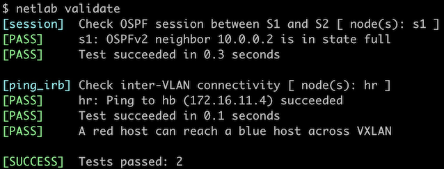

# EVPN Asymmetric Integrated Routing and Bridging

In the [previous lab exercise](3-irb.md), we created an EVPN-based VRF that connected two stretched VLANs. We had an easy task because hosts from every VLAN were connected to every switch. Can you use the same trick if the hosts are sparsely connected (like in the lab topology we'll use in this exercise)?


Of course, you can. If you extend every VLAN to every fabric switch, you get the exact same scenario as in the previous lab exercise:


Obviously, you'd also create too many VLANs, extend the bridging domains, have more entries in the ARP/MAC tables on all switches, and increase flooding traffic, but that's the price you have to pay if you don't want to learn any new concepts ;)

Even though *asymmetric IRB* is clearly a bad solution in scenarios like the one described in this exercise, let's still go through the motions and figure out how to make it work before moving on to a better solution (*symmetric IRB*).

### Device Requirements {#req}

You can use any device supported by the _netlab_ [OSPF](https://netlab.tools/module/ospf/#platform-support), [BGP](https://netlab.tools/module/bgp/#platform-support), and [VLAN](https://netlab.tools/module/vlan/#platform-support) configuration modules. The device should support VXLAN and EVPN.

## Start the Lab

Assuming you already [set up your lab infrastructure](../1-setup.md):

* Change directory to `evpn/4-asym-irb`
* Execute **netlab up**
* Log into lab devices with **netlab connect** and verify that the IP addresses and the OSPF are properly configured.

## Existing Device Configuration

* *red* VLAN is configured on S1. *blue* VLAN is configured on S2:

| VLAN | VLAN tag | IPv4 prefix    |
|------|---------:|---------------:|
| red  | 100      | 172.16.10.0/24 |
| blue | 101      | 172.16.11.0/24 |

* IPv4 addresses are configured on Linux hosts, switch loopback interfaces, and the interswitch link ([details](#addr)).
* Static routes pointing to the anycast gateway are configured on the Linux hosts:

| Host | IPv4 prefix   | Next hop    |
|------|--------------:|------------:|
| HR   | 172.16.0.0/16 | 172.16.10.42 |
| HB   | 172.16.0.0/16 | 172.16.11.42 |

* The switches run OSPF in area 0 across the interswitch link ([details](#ospf)).
* The switches have an IBGP session between their loopback interfaces. The IBGP session is currently configured to exchange IPv4 prefixes ([details](#bgp)).

## Configure Integrated Routing

You'll configure the VLANs, *tenant* VRF, IP addresses on switch VLAN interfaces, and anycast gateways before configuring VXLAN or EVPN:

* Configure *blue* VLAN and an associated VLAN interface on S1
* Configure *red* VLAN and an associated VLAN interface on S2
* Create a *tenant* VRF and enable IP routing in that VRF
* Put the *red* and *blue* VLAN interfaces into the *tenant* VRF
* Configure the following IP addresses on S1 and S2:

| Node/Interface | IPv4 Address | Description |
|----------------|-------------:|-------------|
| **s1** |||
| Vlan100 | 172.16.10.1/24 | VLAN red (100) -> [hr,s2] (VRF: tenant) |
| Vlan101 | 172.16.11.1/24 | VLAN blue (101) -> [hb,s2] (VRF: tenant) |
| **s2** |||
| Vlan101 | 172.16.11.2/24 | VLAN blue (101) -> [s1,hb] (VRF: tenant) |
| Vlan100 | 172.16.10.2/24 | VLAN red (100) -> [hr,s1] (VRF: tenant) |

* Using the commands you mastered in the [Anycast Gateways on VXLAN Segments](../vxlan/4-anycast.md) lab exercise, configure the anycast gateways (or active-active VRRP) on *red* and *blue* VLANs using these IP addresses:

| VLAN | Gateway IP address |
|------|----------------:|
| red  | 172.16.10.42/24 |
| blue | 172.16.11.42/24 |

* If you're using VRRP, make sure that the switch closer to the host becomes the VRRP master

## Configure VXLAN and EVPN

Using the procedure you mastered in the [Build an EVPN-based MAC-VRF instance](1-bridging.md) and [Integrated Routing and Bridging (IRB) with EVPN](3-irb.md) lab exercises, configure:

* EVPN address family on the S1-S2 IBGP session
* MAC-VRF for the *red* and *blue* VLANs *on S1 and S2* using these parameters:

| VLAN | VNI   | route target |
|------|------:|-------------:|
| red  | 10010 | 65000:100 |
| blue | 10011 | 65000:101 |

* Any additional nerd knobs that might be required to make IRB work on your platform.

## Verification

If you used FRRouting or Arista EOS devices as the lab switches, you can use the **netlab validate** command to check your work:



Alternatively, use **ping** to check that HR and HB can communicate (proving that inter-subnet routing across VXLAN segments works):

```
$ netlab connect hr ping -c 3 hb
Connecting to container clab-asymirb-hr, executing ping -c 3 hb
PING hb (172.16.11.4): 56 data bytes
64 bytes from 172.16.11.4: seq=0 ttl=63 time=2.307 ms
64 bytes from 172.16.11.4: seq=1 ttl=63 time=1.944 ms
64 bytes from 172.16.11.4: seq=2 ttl=63 time=2.407 ms

--- hb ping statistics ---
3 packets transmitted, 3 packets received, 0% packet loss
round-trip min/avg/max = 1.944/2.219/2.407 ms
```

Use the troubleshooting hints from the [Build an EVPN-based MAC-VRF instance](1-bridging.md#tshoot) and [Integrated Routing and Bridging (IRB) with EVPN](3-irb.md#tshoot) lab exercises if needed (we expect you're familiar with the traditional routing between VLAN segments).

## Cheating

* Shut down your lab with the **netlab down** command
* Start the lab from the `solution.yml` topology with the **netlab up solution.yml** command
* Explore the S1/S2 device configuration

## Reference Information

### Lab Wiring {#wiring}

| Origin Device | Origin Port | Destination Device | Destination Port |
|---------------|-------------|--------------------|------------------|
| s1 | Ethernet1 | s2 | Ethernet1 |
| hr | eth1 | s1 | Ethernet2 |
| hb | eth1 | s2 | Ethernet2 |

### Lab Addressing {#addr}

| Node/Interface | IPv4 Address | IPv6 Address | Description |
|----------------|-------------:|-------------:|-------------|
| **s1** |  10.0.0.1/32 |  | Loopback |
| Ethernet1 | 10.1.0.1/30 |  | s1 -> s2 |
| **s2** |  10.0.0.2/32 |  | Loopback |
| Ethernet1 | 10.1.0.2/30 |  | s2 -> s1 |
| **hr** | 
| eth1 | 172.16.10.3/24 |  | hr -> s1 [red VLAN] |
| **hb** | 
| eth1 | 172.16.11.4/24 |  | hb -> s2 [blue VLAN] |

### OSPF Routing (Area 0) {#ospf}

| Router | Interface | IPv4 Address | Neighbor(s) |
|--------|-----------|-------------:|-------------|
| s1 | Loopback | 10.0.0.1/32 | |
|  | Ethernet1 | 10.1.0.1/30 | s2 |
| s2 | Loopback | 10.0.0.2/32 | |
|  | Ethernet1 | 10.1.0.2/30 | s1 |

### BGP Routing {#bgp}

| Node | Router ID/<br />Neighbor | Router AS/<br />Neighbor AS | Neighbor IPv4 |
|------|------------------|---------------------:|--------------:|
| **s1** | 10.0.0.1 | 65000 |
| | s2 | 65000 | 10.0.0.2 |
| **s2** | 10.0.0.2 | 65000 |
| | s1 | 65000 | 10.0.0.1 |
