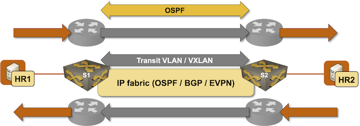

# Implement VRF-Lite with EVPN/VXLAN

In the [Implement VRF-Lite with VXLAN](../vxlan/5-vrf-lite.md) lab exercise, you learned how you can use VXLAN segments (acting as transit VLANs) to build a VRF-Lite service. In this lab exercise, we'll do exactly the same, but use the EVPN control plane for the transit VXLAN segments.


Effectively, you'll:

* Create a virtual LAN segment between the edge switches
* Run a routing protocol *in each VRF* between the edge switches
* Use the edge switches as regular routers: the ingress switch will *route* the IP packets into the VXLAN segment, and the egress switch will receive VXLAN-encapsulated Ethernet/IP frames and *route* them to the final destination.
* The same process will happen in the reverse path, resulting in *symmetrical routing*.



!!! tip
    This is not how one would typically implement routing with EVPN, but it's a nice transition from bridging/asymmetric IRB to EVPN symmetric IRB with type-5 EVPN routes.

### Device Requirements {#req}

You can use any device supported by the _netlab_ [OSPF](https://netlab.tools/module/ospf/#platform-support), [BGP](https://netlab.tools/module/bgp/#platform-support), and [VRF](https://netlab.tools/module/vrf/#platform-support) configuration modules. The device should also support:

* EVPN bridging with VXLAN encapsulation
* Routing in and out of VXLAN tunnels (VXLAN RIOT)
* Running a routing protocol on a VXLAN segment[^RPV]

[^RPV]: Some devices cannot run control-plane protocols on VXLAN segments.

## Start the Lab

Assuming you already [set up your lab infrastructure](../1-setup.md):

* Change directory to `evpn/5-vrf-lite`
* Execute **netlab up**
* Log into lab devices with **netlab connect** and verify that the IP addresses and the OSPF are properly configured.

## Existing Device Configuration

* The switches in your lab (S1, S2, and S3) are preconfigured with *red* and *blue* VRFs.
* IPv4 addresses are configured on all links in your lab ([details](#addr)).
* Linux hosts use the adjacent switches as the default gateways
* The switches run OSPF in area 0 in the default VRF with the core router ([details](#ospf)).
* There's a full mesh of IBGP sessions between the three switches.

## Configuration Guidelines

You'll implement the transport between VRF instances on S1, S2, and S3 with VXLAN segments using the EVPN control plane:

* Create *red* and *blue* transit VLANs for the Red and Blue VRFs (one VLAN per VRF)

| VLAN | VLAN ID | Configured on |
|------|---------|---------------|
| red  | 100     | S1, S2, S3    |
| blue | 101     | S1, S2        |

* Create VLAN interfaces for the transport VLAN.
* Assign the VLAN interfaces to the *red*/*blue* VRFs.
* Use the following IP addresses on the VLAN interfaces:

| Node/Interface | IPv4 Address | Description |
|----------------|-------------:|-------------|
| **s1** | | |
| Vlan100 | 192.168.100.1/24 | VLAN red (100) -> [s2,s3] (VRF: red) |
| Vlan101 | 192.168.101.1/24 | VLAN blue (101) -> [s2] (VRF: blue) |
| **s2** | | |
| Vlan100 | 192.168.100.2/24 | VLAN red (100) -> [s1,s3] (VRF: red) |
| Vlan101 | 192.168.101.2/24 | VLAN blue (101) -> [s1] (VRF: blue) |
| **s3** | | |
| Vlan100 | 192.168.100.3/24 | VLAN red (100) -> [s1,s2] (VRF: red) |

* Using the procedure you mastered in the [Build an EVPN-based MAC-VRF instance](1-bridging.md) lab exercise, create MAC-VRF instances for the *red* and *blue* VLANs.
* Enable the EVPN address family on IBGP sessions
* Configure VRF routing protocols between S1, S2, and S3 in *red* and *blue* VRFs. Use OSPF whenever possible, and BGP as a potential fallback.

## Verification

* Check EVPN routes and VXLAN segments on S1, S2, and S3. You might see only the IMET EVPN routes on some platforms.
* Try to ping between the VLAN interfaces. Please note that you have to use VRF **ping** as the VLAN interfaces belong to Red/Blue VRFs:

Using VRF Red to ping the Red VLAN interface on S2 from S1
{.code-caption}
```
s1#ping vrf red 192.168.100.2
PING 192.168.100.2 (192.168.100.2) 72(100) bytes of data.
80 bytes from 192.168.100.2: icmp_seq=1 ttl=64 time=1.77 ms
80 bytes from 192.168.100.2: icmp_seq=2 ttl=64 time=1.27 ms
80 bytes from 192.168.100.2: icmp_seq=3 ttl=64 time=1.23 ms
80 bytes from 192.168.100.2: icmp_seq=4 ttl=64 time=1.02 ms
80 bytes from 192.168.100.2: icmp_seq=5 ttl=64 time=0.827 ms

--- 192.168.100.2 ping statistics ---
5 packets transmitted, 5 received, 0% packet loss, time 8ms
rtt min/avg/max/mdev = 0.827/1.222/1.768/0.315 ms, ipg/ewma 2.000/1.475 ms
```

!!! tip
    If needed, follow the [troubleshooting hints](1-bridging.md#tshoot) from the [Build an EVPN-based MAC-VRF instance](1-bridging.md) lab exercise.

* Check in-VRF routing protocol adjacences between S1, S2, and S3.

OSPF neighbors (global and VRF) on S1
{.code-caption}
```
s1#show ip ospf neighbor vrf all
Neighbor ID     Instance VRF      Pri State                  Dead Time   Address         Interface
10.0.0.4        1        default  1   FULL                   00:00:34    10.1.0.1        Ethernet1
10.0.0.2        100      red      1   FULL/BDR               00:00:36    192.168.100.2   Vlan100
10.0.0.3        100      red      1   FULL/DR                00:00:35    192.168.100.3   Vlan100
10.0.0.2        101      blue     0   FULL                   00:00:36    192.168.101.2   Vlan101
```

* Check VRF routing tables on S1, S2, and S3. Remote IP prefixes should be reachable as OSPF routes with next hops attached to the VLAN interfaces.

Routing table for VRF Red on S1
{.code-caption}
```
s1#show ip route vrf red | begin Gateway
Gateway of last resort is not set

 C        172.16.0.0/24
           directly connected, Ethernet2
 O        172.16.1.0/24 [110/20]
           via 192.168.100.2, Vlan100
 O        172.16.2.0/24 [110/20]
           via 192.168.100.3, Vlan100
 C        192.168.100.0/24
           directly connected, Vlan100
```

* Ping between **hr1**, **hr2**, and **hr3**
* Ping between **hb1** and **hb2**

## Cheating

* Shut down your lab with the **netlab down** command
* Start the lab from the `solution.yml` topology with the **netlab up solution.yml** command
* Explore the S1/S2/S3 device configuration

## The Curious Case of the Missing MAC Routes

... and the missing section 😎

## Reference Information

### Lab Wiring {#wiring}

| Origin Device | Origin Port | Destination Device | Destination Port |
|---------------|-------------|--------------------|------------------|
| s1 | Ethernet1 | core | eth1 |
| s2 | Ethernet1 | core | eth2 |
| s3 | Ethernet1 | core | eth3 |
| hr1 | eth1 | s1 | Ethernet2 |
| hr2 | eth1 | s2 | Ethernet2 |
| hr3 | eth1 | s3 | Ethernet2 |
| hb1 | eth1 | s1 | Ethernet3 |
| hb2 | eth1 | s2 | Ethernet3 |

### Lab Addressing {#addr}

| Node/Interface | IPv4 Address | IPv6 Address | Description |
|----------------|-------------:|-------------:|-------------|
| **s1** |  10.0.0.1/32 |  | Loopback |
| Ethernet1 | 10.1.0.2/30 |  | s1 -> core |
| Ethernet2 | 172.16.0.1/24 |  | s1 -> hr1 (VRF: red) |
| Ethernet3 | 172.16.3.1/24 |  | s1 -> hb1 (VRF: blue) |
| **s2** |  10.0.0.2/32 |  | Loopback |
| Ethernet1 | 10.1.0.6/30 |  | s2 -> core |
| Ethernet2 | 172.16.1.2/24 |  | s2 -> hr2 (VRF: red) |
| Ethernet3 | 172.16.4.2/24 |  | s2 -> hb2 (VRF: blue) |
| **s3** |  10.0.0.3/32 |  | Loopback |
| Ethernet1 | 10.1.0.10/30 |  | s3 -> core |
| Ethernet2 | 172.16.2.3/24 |  | s3 -> hr3 (VRF: red) |
| **core** |  10.0.0.4/32 |  | Loopback |
| eth1 | 10.1.0.1/30 |  | core -> s1 |
| eth2 | 10.1.0.5/30 |  | core -> s2 |
| eth3 | 10.1.0.9/30 |  | core -> s3 |
| **hr1** | 
| eth1 | 172.16.0.5/24 |  | hr1 -> s1 |
| **hr2** | 
| eth1 | 172.16.1.6/24 |  | hr2 -> s2 |
| **hr3** | 
| eth1 | 172.16.2.7/24 |  | hr3 -> s3 |
| **hb1** | 
| eth1 | 172.16.3.8/24 |  | hb1 -> s1 |
| **hb2** | 
| eth1 | 172.16.4.9/24 |  | hb2 -> s2 |

### OSPF Routing (Area 0) {#ospf}

| Router | Interface | IPv4 Address | Neighbor(s) |
|--------|-----------|-------------:|-------------|
| s1 | Loopback | 10.0.0.1/32 | |
|  | Ethernet1 | 10.1.0.2/30 | core |
| s2 | Loopback | 10.0.0.2/32 | |
|  | Ethernet1 | 10.1.0.6/30 | core |
| s3 | Loopback | 10.0.0.3/32 | |
|  | Ethernet1 | 10.1.0.10/30 | core |
| core | Loopback | 10.0.0.4/32 | |
|  | eth1 | 10.1.0.1/30 | s1 |
|  | eth2 | 10.1.0.5/30 | s2 |
|  | eth3 | 10.1.0.9/30 | s3 |

### BGP Routing {#bgp}

| Node | Router ID/<br />Neighbor | Router AS/<br />Neighbor AS | Neighbor IPv4 |
|------|------------------|---------------------:|--------------:|
| **s1** | 10.0.0.1 | 65000 |
| | s2 | 65000 | 10.0.0.2 |
| | s3 | 65000 | 10.0.0.3 |
| **s2** | 10.0.0.2 | 65000 |
| | s1 | 65000 | 10.0.0.1 |
| | s3 | 65000 | 10.0.0.3 |
| **s3** | 10.0.0.3 | 65000 |
| | s1 | 65000 | 10.0.0.1 |
| | s2 | 65000 | 10.0.0.2 |
