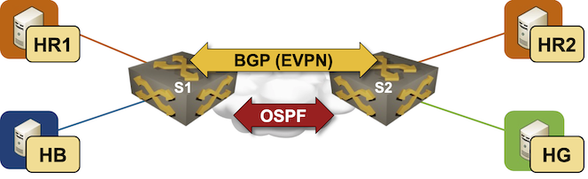

# Symmetric IRB with IP-VRF EVPN instances

In the [Build an EVPN-based MAC-VRF instance](1-bridging.md) lab exercise, you learned how to configure a MAC-VRF instance to enable bridging across a VXLAN segment with the EVPN control plane. In the [VPN IP Routing in EVPN Fabrics](6-ip-routing.md) one, you used an IP-VRF instance to implement IP routing for a tenant network. Can we combine the two approaches? Definitely, you'll master that in this lab exercise.



To build a network for our tenant, you could use [asymmetric IRB](4-asym-irb.md): extend the *blue* VLAN to S2, extend the *green* VLAN to S1, and create three MAC-VRF instances. We'll use a much better approach: we'll configure a MAC-VRF instance to extend the *red* VLAN and an EVPN IP-VRF instance with a transit VXLAN segment to route between the three VLANs.

!!! tip
    This lab exercise does not introduce new concepts. It's a comprehensive recap of everything you've learned so far.
    
### Device Requirements {#req}

You can use any device supported by the _netlab_ [OSPF](https://netlab.tools/module/ospf/#platform-support), [BGP](https://netlab.tools/module/bgp/#platform-support), [VLAN](https://netlab.tools/module/vlan/#platform-support), and [VRF](https://netlab.tools/module/vrf/#platform-support) configuration modules. The device should also support:

* VXLAN encapsulation with EVPN control plane
* EVPN transit VNI
* EVPN type-5 routes
* Routing in and out of VXLAN tunnels (VXLAN RIOT)

## Start the Lab

Assuming you already [set up your lab infrastructure](../1-setup.md):

* Change directory to `evpn/7-symm-irb`
* Execute **netlab up**
* Log into lab devices with **netlab connect** and verify that the IP addresses and IP routing are properly configured.

## Existing Device Configuration

* The switches in your lab (S1 and S2) are preconfigured with the *red*, *blue*, and *green* VLANs.
* IPv4 addresses are configured on links and VLANs ([details](#addr)).
* Linux hosts in the *blue* and *green* VLAN use the adjacent switches as the default gateways
* Linux hosts in the *red* VLAN rely on an anycast gateway you'll configure as part of this lab exercise
* The switches run OSPF in area 0 in the default VRF with the core router ([details](#ospf)).
* There's a full mesh of IBGP sessions between the three switches.

## Configuration Guidelines

Use the following steps to configure S1 and S2:

* Configure the anycast first-hop gateway (`172.16.11.42`) in the *red* VLAN using what you've learned in the [Integrated Routing and Bridging (IRB) with EVPN](3-irb.md) exercise
* Using the process you've mastered in the [Build an EVPN-based MAC-VRF instance](1-bridging.md) lab exercise, enable EVPN and configure a MAC-VRF instance for the *red* VLAN.

| Parameter     | Value     |
|---------------|----------:|
| EVPN instance |       101 |
| VXLAN VNI     |     10101 |
| Route target  | 65000:101 |

* Using the knowledge gained in the [VPN IP Routing in EVPN Fabrics](6-ip-routing.md) lab exercise, configure an IP-VRF instance for the *tenant* VRF

| Parameter           | Value   |
|---------------------|--------:|
| EVPN instance       |       1 |
| Transit (L3) VNI    |    5042 |
| Route distinguisher | 65000:1 |
| Route target        | 65000:1 |

## Verification

* Check the EVPN routes. You should see the IMET routes for the *red* VLAN and the IP-PREFIX routes for all three subnets. Both routers should originate the prefix for the *red* subnet.

EVPN routes on S1 running Arista EOS
{.code-caption}
```text
s1#show bgp evpn
BGP routing table information for VRF default
Router identifier 10.0.0.1, local AS number 65000
Route status codes: * - valid, > - active, S - Stale, E - ECMP head, e - ECMP
                    c - Contributing to ECMP, % - Pending best path selection
Origin codes: i - IGP, e - EGP, ? - incomplete
AS Path Attributes: Or-ID - Originator ID, C-LST - Cluster List, LL Nexthop - Link Local Nexthop

          Network                Next Hop              Metric  LocPref Weight  Path
 * >      RD: 10.0.0.1:101 imet 10.0.0.1
                                 -                     -       -       0       i
 * >      RD: 10.0.0.1:102 imet 10.0.0.1
                                 -                     -       -       0       i
 * >      RD: 10.0.0.2:101 imet 10.0.0.2
                                 10.0.0.2              -       100     0       i
 * >      RD: 10.0.0.2:103 imet 10.0.0.2
                                 10.0.0.2              -       100     0       i
 * >      RD: 65000:1 ip-prefix 172.16.11.0/24
                                 -                     -       -       0       i
 *        RD: 65000:1 ip-prefix 172.16.11.0/24
                                 10.0.0.2              -       100     0       i
 * >      RD: 65000:1 ip-prefix 172.16.12.0/24
                                 -                     -       -       0       i
 * >      RD: 65000:1 ip-prefix 172.16.13.0/24
                                 10.0.0.2              -       100     0       i
```

* Check the VRF IP routing table. It should contain all three subnets

VRF IP routing table on S1 running Arista EOS
{.code-caption}
```text
s1#show ip route vrf tenant | begin Gateway
Gateway of last resort is not set

 C        172.16.11.0/24
           directly connected, Vlan101
 C        172.16.12.0/24
           directly connected, Vlan102
 B I      172.16.13.0/24 [200/0]
           via VTEP 10.0.0.2 VNI 5042 router-mac 00:1c:73:c8:82:78 local-interface Vxlan1
```

* Ping **hr2** from **hr1**. If the ping doesn't work, you misconfigured the MAC-VRF instance and might revisit these [troubleshooting hints](1-bridging.md#tshoot)
* Ping **hg** from **hb**. If you get no response, your IP-VRF instance doesn't work correctly; use [these troubleshooting hints](6-ip-routing.md#tshoot)
* Ping **hb** from **hr1** and **hg** from **hr2**. These pings rely on the (local) anycast gateway in the *red* VLAN. If they don't work, figure out what you missed there.

Does it all work? Fantastic. You mastered the most important EVPN concepts and implementation details (but don't skip the *[packet forwarding](#pfd)* recap).

## Cheating

Can't get your lab to work? Maybe you can cheat your way through it:

* Shut down your lab with the **netlab down** command
* Start the lab from the `solution.yml` topology with the `netlab up solution.yml` command
* Explore the S1/S2 device configuration

## Recap: Packet Forwarding in Tenant Network {#pfd}

Let's recap how we implemented the packet forwarding in the tenant network:

* Bridging within the *red* VLAN uses a MAC-VRF instance
* Routing within the *tenant* VRF uses an IP-VRF instance
* Both switches act as first-hop gateways for the attached hosts


That setup results in the following forwarding paths:

| From | To  | Forwarding<br>mechanism | Forwarding<br>path |
|------|-----|-------------------------|--------------------|
| HR1  | HR2 | Bridging | Bridging into *red* VNI on S1<br>Bridging from *red* VNI into *red* VLAN on S2 |
| HB   | HG  | Routing  | Routing into transit VNI on S1<br>Routing from transit VNI into green VLAN on S2 |
| HB   | HR2 | Routing +<br>bridging | Routing into *red* VLAN on S1<br>Bridging into *red* VNI on S1<br>Bridging from *red* VNI into *red* VLAN on S2 |
| HR1  | HG  | Routing | Routing into transit VNI on S1<br>Routing from transit VNI into green VLAN on S2 |

## Reference Information

### Lab Wiring {#wiring}

| Origin Device | Origin Port | Destination Device | Destination Port |
|---------------|-------------|--------------------|------------------|
| s1 | Ethernet1 | s2 | Ethernet1 |
| hr1 | eth1 | s1 | Ethernet2 |
| hr2 | eth1 | s2 | Ethernet2 |
| hb | eth1 | s1 | Ethernet3 |
| hg | eth1 | s2 | Ethernet3 |

### Lab Addressing {#addr}

| Node/Interface | IPv4 Address | IPv6 Address | Description |
|----------------|-------------:|-------------:|-------------|
| **s1** |  10.0.0.1/32 |  | Loopback |
| Ethernet1 | 10.1.0.1/30 |  | s1 -> s2 |
| Vlan101 | 172.16.11.1/24 |  | VLAN red (101) -> [hr1,hr2,s2] (VRF: tenant) |
| Vlan102 | 172.16.12.1/24 |  | VLAN blue (102) -> [hb] (VRF: tenant) |
| **s2** |  10.0.0.2/32 |  | Loopback |
| Ethernet1 | 10.1.0.2/30 |  | s2 -> s1 |
| Vlan101 | 172.16.11.2/24 |  | VLAN red (101) -> [hr1,s1,hr2] (VRF: tenant) |
| Vlan103 | 172.16.13.2/24 |  | VLAN green (103) -> [hg] (VRF: tenant) |
| **hb** | 
| eth1 | 172.16.12.3/24 |  | hb -> [s1] |
| **hg** | 
| eth1 | 172.16.13.4/24 |  | hg -> [s2] |
| **hr1** | 
| eth1 | 172.16.11.5/24 |  | hr1 -> [s1,hr2,s2] |
| **hr2** | 
| eth1 | 172.16.11.6/24 |  | hr2 -> [hr1,s1,s2] |

### OSPF Routing (Area 0) {#ospf}

| Router | Interface | IPv4 Address | Neighbor(s) |
|--------|-----------|-------------:|-------------|
| s1 | Loopback | 10.0.0.1/32 | |
|  | Ethernet1 | 10.1.0.1/30 | s2 |
| s2 | Loopback | 10.0.0.2/32 | |
|  | Ethernet1 | 10.1.0.2/30 | s1 |

### BGP Routing {#bgp}

## BGP Neighbors

| Node | Router ID/<br />Neighbor | Router AS/<br />Neighbor AS | Neighbor IPv4 |
|------|------------------|---------------------:|--------------:|
| **s1** | 10.0.0.1 | 65000 |
| | s2 | 65000 | 10.0.0.2 |
| **s2** | 10.0.0.2 | 65000 |
| | s1 | 65000 | 10.0.0.1 |
