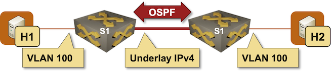

# Extend a Single VLAN Segment with VXLAN

VXLAN is a data-plane-only technology that encapsulates Ethernet frames in UDP packets (using the VXLAN header defined in the [RFC  7348](https://datatracker.ietf.org/doc/html/rfc7348) as the shim between the two). In this lab exercise, you'll use VXLAN (*overlay* network) to extend a single VLAN across an IP-only backbone (*underlay* network):



### Device Requirements {#req}

You can use any device supported by the _netlab_ [OSPF](https://netlab.tools/module/ospf/#platform-support) and [VLAN](https://netlab.tools/module/vlan/#platform-support) configuration modules. The device should support VXLAN with static ingress replication.

## Start the Lab

Assuming you already [set up your lab infrastructure](../1-setup.md):

* Change directory to `vxlan/1-single`
* Execute **netlab up**
* Log into lab devices with **netlab connect** and verify that the IP addresses and the OSPF are properly configured.

## Existing Device Configuration

* The switches in your lab (S1 and S2) are preconfigured with a *tenant* VLAN with VLAN tag 100.
* IPv4 addresses are configured on Linux hosts, switch loopback interfaces, and the interswitch link ([details](#addr)).
* The switches run OSPF in area 0 across the interswitch link ([details](#ospf)).

## Configuration Tasks

Configuring VXLAN on a switch is usually a multi-step process:

* Configure a VXLAN interface (`Vxlan1` on Arista EOS) and assign a local VTEP address (or source interface) to it. You'll use the loopback IPv4 address as the VTEP address.
* Optionally, set the VXLAN destination UDP port (the standard IANA-allocated VXLAN UDP port is 4789)

To extend a VLAN across an underlay network with VXLAN, you have to:

* Map a local VLAN to a VXLAN Virtual Network Identifier (VNI)[^VTM]. Arista EOS does the mapping within the VXLAN interface configuration.
* Configure a flood list (a list of remote VTEPs) for a VXLAN-enabled VLAN or VNI. The flood list is used to propagate copies of Ethernet BUM (Broadcast, Unknown unicast, Multicast)  packets to all other VTEPs participating in the same VXLAN segment. The flood list is also configured within the VXLAN interface configuration on Arista EOS.

[^VTM]: The VNI must match across VTEPs; the local VLAN tag does not have to.

The underlay network should be able to transport 1500-byte overlay IP packets. You should therefore increase the IP MTU size on the underlay links to at least 1550 bytes[^M1560] due to VXLAN encapsulation overhead:

* 14 bytes for the Ethernet header
* 8 bytes for the VXLAN header
* 8 bytes for the UDP header
* 20 bytes for the outer IPv4 header

[^M1560]: Setting the IPv4 MTU on the underlay links to 1560 bytes is safer as it allows for one or two levels of VLAN tags in the encapsulated Ethernet frames.

## Verification

Try to ping h2 from h1:

```
$ netlab connect h1 ping h2
Connecting to container clab-single-h1, executing ping h2
PING h2 (172.16.0.4): 56 data bytes
64 bytes from 172.16.0.4: seq=0 ttl=64 time=5.273 ms
64 bytes from 172.16.0.4: seq=1 ttl=64 time=2.048 ms
^C
--- h2 ping statistics ---
2 packets transmitted, 2 packets received, 0% packet loss
round-trip min/avg/max = 2.048/3.660/5.273 ms
```

If that ping succeeds, try pinging with the 1500-byte IPv4 packets. The `-s` parameter of the Linux **ping** command specifies the payload size. The maximum payload that can fit into a 1500-byte packet is 1472 bytes due to the ICMP header (8 bytes) and the IP header (20 bytes).

```
$ netlab connect h1
Connecting to container clab-single-h1, starting bash
h1:/# ping h2 -s 1472
PING h2 (172.16.0.4): 1472 data bytes
1480 bytes from 172.16.0.4: seq=0 ttl=64 time=5.362 ms
1480 bytes from 172.16.0.4: seq=1 ttl=64 time=2.604 ms
1480 bytes from 172.16.0.4: seq=2 ttl=64 time=2.563 ms
^C
--- h2 ping statistics ---
3 packets transmitted, 3 packets received, 0% packet loss
round-trip min/avg/max = 2.563/3.509/5.362 ms
```

You forgot to change the MTU size on the underlay links if the simple ping succeeds, but the large-packet ping fails.

## Troubleshooting {#tshoot}

Use these troubleshooting steps if the Linux host can't communicate over the stretched VLAN segment:

!!! note
    The troubleshooting instructions use Arista EOS **show** commands and corresponding printouts. You'll have to find matching commands if you use some other platform.

* Verify OSPF connectivity between S1 and S2:

```
s1#show ip ospf neighbor
Neighbor ID     Instance VRF      Pri State                  Dead Time   Address         Interface
10.0.0.2        1        default  0   FULL                   00:00:38    10.1.0.2        Ethernet1
```

* Verify that S1 and S2 have routes to both loopback interfaces in their routing tables

```
s1#show ip route
...
Gateway of last resort is not set

 C        10.0.0.1/32
           directly connected, Loopback0
 O        10.0.0.2/32 [110/20]
           via 10.1.0.2, Ethernet1
 C        10.1.0.0/30
           directly connected, Ethernet1
```

* Verify that S1 and S2 can ping each other's loopback interfaces *from the source IPv4 address of the local loopback interface*:

```
s1#ping 10.0.0.2 source 10.0.0.1
PING 10.0.0.2 (10.0.0.2) from 10.0.0.1 : 72(100) bytes of data.
80 bytes from 10.0.0.2: icmp_seq=1 ttl=64 time=0.096 ms
80 bytes from 10.0.0.2: icmp_seq=2 ttl=64 time=0.007 ms
80 bytes from 10.0.0.2: icmp_seq=3 ttl=64 time=0.004 ms
80 bytes from 10.0.0.2: icmp_seq=4 ttl=64 time=0.005 ms
80 bytes from 10.0.0.2: icmp_seq=5 ttl=64 time=0.009 ms

--- 10.0.0.2 ping statistics ---
5 packets transmitted, 5 received, 0% packet loss, time 0ms
rtt min/avg/max/mdev = 0.004/0.024/0.096/0.035 ms, ipg/ewma 0.038/0.059 ms
```

If you have gotten this far, your *underlay* network works correctly. Next, let's check the VXLAN configuration:

* The **show vxlan vni** command displays VLAN-to-VXLAN mapping. Check that you correctly mapped VLAN 100 to a VXLAN VNI and that you used the same VNI on S1 and S2.

```
s1#show vxlan vni
VNI to VLAN Mapping for Vxlan1
VNI          VLAN       Source       Interface       802.1Q Tag
------------ ---------- ------------ --------------- ----------
100100       100        static       Ethernet2       untagged
                                     Vxlan1          100
```

* The **show vxlan vtep** command displays remote VTEPs (ingress replication flood list). Check that you configured the remote VTEP loopback IP address in the flood list for your VNI:

```
s1#show vxlan vtep
Remote VTEPS for Vxlan1:

VTEP           Tunnel Type(s)
-------------- --------------
10.0.0.2       unicast, flood

Total number of remote VTEPS:  1
```

* You can also use the **show vxlan flood vtep** command to display the same information in a slightly different format.

```
s1#show vxlan flood vtep
          VXLAN Flood VTEP Table
--------------------------------------------------------------------------------

VLANS                            Ip Address
-----------------------------   ------------------------------------------------
100                             10.0.0.2
```

* End-to-end VXLAN should work if all the above printouts seem correct. However, you might also want to check the VLAN ports with the **show vlan** command and the spanning tree status with the **show spanning-tree** command.

```
s1#show vlan
VLAN  Name                             Status    Ports
----- -------------------------------- --------- -------------------------------
1     default                          active
100   tenant                           active    Cpu, Et2, Vx1

s1#show spanning-tree
MST0
  Spanning tree enabled protocol mstp
  Root ID    Priority    32768
             Address     001c.73a5.db35
             This bridge is the root

  Bridge ID  Priority    32768  (priority 32768 sys-id-ext 0)
             Address     001c.73a5.db35
             Hello Time  2.000 sec  Max Age 20 sec  Forward Delay 15 sec

Interface        Role       State      Cost      Prio.Nbr Type
---------------- ---------- ---------- --------- -------- --------------------
Et2              designated forwarding 20000     128.2    P2p Edge
```

* Finally, the **show vxlan address-table** command displays MAC addresses learned from the incoming VXLAN packets, while the **show mac address-table** command displays MAC addresses learned from local interfaces and incoming VXLAN packets:

```
s1#show vxlan address-table
          Vxlan Mac Address Table
----------------------------------------------------------------------

VLAN  Mac Address     Type      Prt  VTEP             Moves   Last Move
----  -----------     ----      ---  ----             -----   ---------
 100  aac1.ab87.58b8  DYNAMIC   Vx1  10.0.0.2         1       0:00:05 ago
Total Remote Mac Addresses for this criterion: 1
s1#show mac address-table
          Mac Address Table
------------------------------------------------------------------

Vlan    Mac Address       Type        Ports      Moves   Last Move
----    -----------       ----        -----      -----   ---------
 100    aac1.ab87.58b8    DYNAMIC     Vx1        1       0:00:43 ago
 100    aac1.abc4.959e    DYNAMIC     Et2        1       0:00:43 ago
Total Mac Addresses for this criterion: 2
```

If everything else fails, read the [Arista EOS VXLAN Troubleshooting Guidebook](https://arista.my.site.com/AristaCommunity/s/article/Vxlan-Troubleshooting-Guidebook) or the corresponding documentation for your platform.

## Cheating

* Shut down your lab with the **netlab down** command
* Start the lab from the `solution.yml` topology with the **netlab up solution.yml** command
* Explore the S1/S2 device configuration

## Reference Information

### Lab Wiring {#wiring}

| Origin Device | Origin Port | Destination Device | Destination Port |
|---------------|-------------|--------------------|------------------|
| s1 | Ethernet1 | s2 | Ethernet1 |
| h1 | eth1 | s1 | Ethernet2 |
| h2 | eth1 | s2 | Ethernet2 |

### Lab Addressing {#addr}

| Node/Interface | IPv4 Address | IPv6 Address | Description |
|----------------|-------------:|-------------:|-------------|
| **s1** |  10.0.0.1/32 |  | Loopback |
| Ethernet1 | 10.1.0.1/30 |  | s1 -> s2 |
| Ethernet2 |  |  | [Access VLAN tenant] s1 -> h1 |
| Vlan100 |  |  | VLAN tenant (100) -> [h1,h2,s2] |
| **s2** |  10.0.0.2/32 |  | Loopback |
| Ethernet1 | 10.1.0.2/30 |  | s2 -> s1 |
| Ethernet2 |  |  | [Access VLAN tenant] s2 -> h2 |
| Vlan100 |  |  | VLAN tenant (100) -> [h1,s1,h2] |
| **h1** |
| eth1 | 172.16.0.3/24 |  | h1 -> [s1,h2,s2] |
| **h2** |
| eth1 | 172.16.0.4/24 |  | h2 -> [h1,s1,s2] |

### OSPF Routing (Area 0) {#ospf}

| Router | Interface | IPv4 Address | Neighbor(s) |
|--------|-----------|-------------:|-------------|
| s1 | Loopback | 10.0.0.1/32 | |
|  | Ethernet1 | 10.1.0.1/30 | s2 |
| s2 | Loopback | 10.0.0.2/32 | |
|  | Ethernet1 | 10.1.0.2/30 | s1 |
