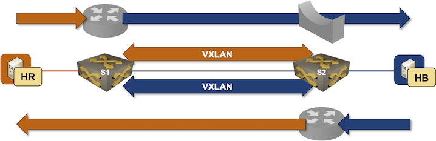

# Routing between VXLAN Segments

In the previous lab exercises, we extended isolated VLANs with VXLAN segments. Now, we'll add routing to the mix: the switches using VXLAN to extend VLANs will also route between them.

The lab topology is as simple as it was in the previous exercises: a pair of hosts per VLAN attached to two directly-connected switches:


### Device Requirements {#req}

You can use any device supported by the _netlab_ [OSPF](https://netlab.tools/module/ospf/#platform-support) and [VLAN](https://netlab.tools/module/vlan/#platform-support) configuration modules. The device should support VXLAN with static ingress replication and routing between VLAN segments.

## Start the Lab

Assuming you already [set up your lab infrastructure](../1-setup.md):

* Change directory to `vxlan/3-irb`
* Execute **netlab up**
* Log into lab devices with **netlab connect** and verify that the IP addresses and the OSPF are properly configured.

## Existing Device Configuration

* The switches in your lab (S1 and S2) are preconfigured with *red* and *blue* VLANs.
* The *red* and *blue* VLANs have these VLAN tags and IPv4 prefixes:

| VLAN | VLAN tag | IPv4 prefix    |
|------|---------:|---------------:|
| red  | 100      | 172.16.10.0/24 |
| blue | 101      | 172.16.11.0/24 |

* IPv4 addresses are configured on Linux hosts, switch loopback interfaces, and the interswitch link ([details](#addr)).
* Static routes pointing to the to-be-configured switch VLAN IP addresses are configured on the Linux hosts. Each static route points to the IP address of the adjacent switch:

| Host | IPv4 prefix   | Next hop    |
|------|--------------:|------------:|
| HR1  | 172.16.0.0/16 | 172.16.10.1 |
| HR1  | 172.16.0.0/16 | 172.16.10.2 |
| HR1  | 172.16.0.0/16 | 172.16.11.1 |
| HR1  | 172.16.0.0/16 | 172.16.11.2 |

* The switches run OSPF in area 0 across the interswitch link ([details](#ospf)).

## Configure Integrated Routing

You'll configure IP addresses on switch VLAN interfaces before configuring VXLAN segments:

* Configure the following IP addresses on S1 and S2:

| VLAN | Switch | IP address     |
|------|--------|---------------:|
| red  | S1     | 172.16.10.1/24 |
|      | S2     | 172.16.10.2/24 |
| blue | S1     | 172.16.11.1/24 | 
|      | S2     | 172.16.11.2/24 |

* Check that the local inter-VLAN routing works: HR1 should be able to reach HB1, and HR2 should be able to reach HB2
* Verify that cross-switch VLAN connectivity does not work: HR1 cannot reach HR2, HB1 cannot reach HB2, and HR1 cannot reach HB2.

!!! warning
    Do not configure OSPF on VLAN interfaces; you'd get recursive routing (and interesting periodic black holes). Even better, create a *tenant* VRF and assign VLAN interfaces to that VRF.

## Configure VXLAN Segments

Using the procedure you mastered in the [Extend a Single VLAN Segment with VXLAN](1-single.md) lab exercise, extend both VLANs across the IP network using these VXLAN network identifiers:

| VLAN | VNI   |
|------|------:|
| red  | 10010 |
| blue | 10011 |

## Verification

Use **ping** on hosts to verify that they can all reach each other:

```
$ netlab connect hr1
Connecting to container clab-irb-hr1, starting bash
hr1:/# ping -c 3 hr2
PING hr2 (172.16.10.4): 56 data bytes
64 bytes from 172.16.10.4: seq=0 ttl=64 time=4.142 ms
64 bytes from 172.16.10.4: seq=1 ttl=64 time=2.205 ms
64 bytes from 172.16.10.4: seq=2 ttl=64 time=2.318 ms

--- hr2 ping statistics ---
3 packets transmitted, 3 packets received, 0% packet loss
round-trip min/avg/max = 2.205/2.888/4.142 ms
hr1:/# ping -c 3 hb1
PING hb1 (172.16.11.5): 56 data bytes
64 bytes from 172.16.11.5: seq=0 ttl=63 time=1.758 ms
64 bytes from 172.16.11.5: seq=1 ttl=63 time=0.871 ms
64 bytes from 172.16.11.5: seq=2 ttl=63 time=0.741 ms

--- hb1 ping statistics ---
3 packets transmitted, 3 packets received, 0% packet loss
round-trip min/avg/max = 0.741/1.123/1.758 ms
hr1:/# ping -c 3 hb2
PING hb2 (172.16.11.6): 56 data bytes
64 bytes from 172.16.11.6: seq=0 ttl=63 time=5.410 ms
64 bytes from 172.16.11.6: seq=1 ttl=63 time=2.072 ms
64 bytes from 172.16.11.6: seq=2 ttl=63 time=2.098 ms

--- hb2 ping statistics ---
3 packets transmitted, 3 packets received, 0% packet loss
round-trip min/avg/max = 2.072/3.193/5.410 ms
```

Use the [troubleshooting hints](1-single.md#tshoot) from the [Extend a Single VLAN Segment with VXLAN](1-single.md) lab exercise if needed (we expect you're familiar with the traditional routing between VLAN segments)

## Behind the Scenes

Each host uses the adjacent switch as the first-hop router. Stretching VLANs over the VXLAN segment thus results in *asymmetric* Integrated Routing and Bridging (IRB) -- the router in the HB1-HR2 path differs from the router in the HR2-HB1 path.



The *traceroute* printout taken on HB1 and HR2 illustrates the traffic flow:

```
$ netlab connect hb1 traceroute hr2
Connecting to container clab-irb-hb1, executing traceroute hr2
traceroute to hr2 (172.16.10.4), 30 hops max, 46 byte packets
 1  Vlan101.s1 (172.16.11.1)  0.694 ms  0.244 ms  0.203 ms
 2  hr2 (172.16.10.4)  5.399 ms  1.373 ms  1.140 ms
$ netlab connect hr2 traceroute hb1
Connecting to container clab-irb-hr2, executing traceroute hb1
traceroute to hb1 (172.16.11.5), 30 hops max, 46 byte packets
 1  Vlan100.s2 (172.16.10.2)  0.756 ms  0.428 ms  0.223 ms
 2  hb1 (172.16.11.5)  1.112 ms  0.754 ms  0.667 ms
```

## Cheating

* Shut down your lab with the **netlab down** command
* Start the lab from the `solution.yml` topology with the **netlab up solution.yml** command
* Explore the S1/S2 device configuration

## Reference Information

### Lab Wiring {#wiring}

| Origin Device | Origin Port | Destination Device | Destination Port |
|---------------|-------------|--------------------|------------------|
| s1 | Ethernet1 | s2 | Ethernet1 |
| hr1 | eth1 | s1 | Ethernet2 |
| hr2 | eth1 | s2 | Ethernet2 |
| hb1 | eth1 | s1 | Ethernet3 |
| hb2 | eth1 | s2 | Ethernet3 |

### Lab Addressing {#addr}

| Node/Interface | IPv4 Address | IPv6 Address | Description |
|----------------|-------------:|-------------:|-------------|
| **s1** |  10.0.0.1/32 |  | Loopback |
| Ethernet1 | 10.1.0.1/30 |  | s1 -> s2 |
| Ethernet2 |  |  | [Access VLAN red] s1 -> hr1 |
| Ethernet3 |  |  | [Access VLAN blue] s1 -> hb1 |
| **s2** |  10.0.0.2/32 |  | Loopback |
| Ethernet1 | 10.1.0.2/30 |  | s2 -> s1 |
| Ethernet2 |  |  | [Access VLAN red] s2 -> hr2 |
| Ethernet3 |  |  | [Access VLAN blue] s2 -> hb2 |
| **hr1** |
| eth1 | 172.16.10.3/24 |  | hr1 -> [s1,hr2,s2] |
| **hr2** |
| eth1 | 172.16.10.4/24 |  | hr2 -> [hr1,s1,s2] |
| **hb1** |
| eth1 | 172.16.11.5/24 |  | hb1 -> [s1,hb2,s2] |
| **hb2** |
| eth1 | 172.16.11.6/24 |  | hb2 -> [hb1,s1,s2] |

### OSPF Routing (Area 0) {#ospf}

| Router | Interface | IPv4 Address | Neighbor(s) |
|--------|-----------|-------------:|-------------|
| s1 | Loopback | 10.0.0.1/32 | |
|  | Ethernet1 | 10.1.0.1/30 | s2 |
| s2 | Loopback | 10.0.0.2/32 | |
|  | Ethernet1 | 10.1.0.2/30 | s1 |