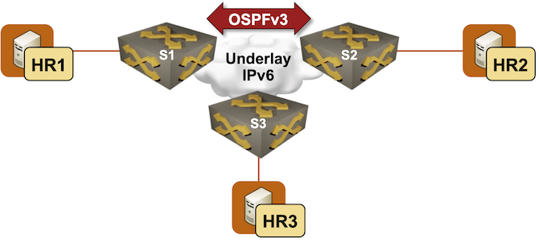

# Running VXLAN over an IPv6-only Underlay Network

While [RFC 7348](https://datatracker.ietf.org/doc/html/rfc7348) specifies VXLAN transport over IPv4 and IPv6, very few vendors implemented VXLAN over IPv6. That unfortunate situation is slowly changing with the advent of IPv6-only data centers (and related customer pressure), leading to several implementations of VXLAN over IPv6. Does your device support it? You'll find out in this lab exercise.



### Device Requirements {#req}

You can use any device supported by the _netlab_ [OSPF](https://netlab.tools/module/ospf/#platform-support) and [VLAN](https://netlab.tools/module/vlan/#platform-support) configuration modules. The device should support VXLAN with static ingress replication over IPv6 transport.

## Start the Lab

Assuming you already [set up your lab infrastructure](../1-setup.md):

* Change directory to `vxlan/6-ipv6`
* Execute **netlab up**
* Log into lab devices with **netlab connect** and verify that the IP addresses and the OSPFv3 routing are properly configured.

## Existing Device Configuration

* The switches in your lab (S1, S2, and S3) are preconfigured with *red* VLAN using VLAN tag 100.
* IPv4 addresses are configured on Linux hosts and switch loopback interfaces[^MSYK]. IPv6 addresses are configured on switch loopback interfaces and interswitch links ([details](#addr)).
* The switches run OSPFv3 in area 0 ([details](#ospf)).

[^MSYK]: Making sure you know what you're doing -- you'd be able to configure VXLAN over IPv4, but it wouldn't work.

## Configuration Tasks

Using the commands you mastered in the [Extend a Single VLAN Segment with VXLAN](1-single.md) lab exercise, extend the *red* VLAN between all three switches. You'll also have to:

* Configure IPv6 transport for VXLAN. That's often configured on the VXLAN interface, and the parameter is sometimes called **vxlan encapsulation**.
* Use IPv6 peer VTEP addresses in the VXLAN ingress replication lists.

## Verification and Troubleshooting

H1, H2, and H3 should be able to ping each other. Use commands similar to **netlab connect h1 ping h2** to check that.

Use the [troubleshooting hints](1-single.md#tshoot) from the [Extend a Single VLAN Segment with VXLAN](1-single.md) lab exercise if you can't establish end-to-end connectivity.

You should also check that the ingress replication lists use IPv6 addresses with commands similar to **show vxlan flood vtep**

Per-VLAN VXLAN ingress replication lists on S1 running Arista EOS
{.code-caption}
```
s1#show vxlan flood vtep
          VXLAN Flood VTEP Table
--------------------------------------------------------------------------------

VLANS                            Ip Address
-----------------------------   ------------------------------------------------
100                             2001:db8:cafe:2::1 2001:db8:cafe:3::1
```

## Cheating

* Shut down your lab with the **netlab down** command
* Start the lab from the `solution.yml` topology with the **netlab up solution.yml** command
* Explore the device configurations

## Reference Information

### Lab Wiring {#wiring}

| Origin Device | Origin Port | Destination Device | Destination Port |
|---------------|-------------|--------------------|------------------|
| s1 | Ethernet1 | s2 | Ethernet1 |
| s2 | Ethernet2 | s3 | Ethernet1 |
| s3 | Ethernet2 | s1 | Ethernet2 |
| s1 | Ethernet3 | h1 | eth1 |
| s2 | Ethernet3 | h2 | eth1 |
| s3 | Ethernet3 | h3 | eth1 |

### Lab Addressing {#addr}

| Node/Interface | IPv4 Address | IPv6 Address | Description |
|----------------|-------------:|-------------:|-------------|
| **s1** |  10.0.0.1/32 | 2001:db8:cafe:1::1/64 | Loopback |
| Ethernet1 |  | 2001:db8:101::1/64 | s1 -> s2 |
| Ethernet2 |  | 2001:db8:101:2::1/64 | s1 -> s3 |
| **s2** |  10.0.0.2/32 | 2001:db8:cafe:2::1/64 | Loopback |
| Ethernet1 |  | 2001:db8:101::2/64 | s2 -> s1 |
| Ethernet2 |  | 2001:db8:101:1::1/64 | s2 -> s3 |
| **s3** |  10.0.0.3/32 | 2001:db8:cafe:3::1/64 | Loopback |
| Ethernet1 |  | 2001:db8:101:1::2/64 | s3 -> s2 |
| Ethernet2 |  | 2001:db8:101:2::2/64 | s3 -> s1 |
| **h1** |
| eth1 | 172.16.0.4/24 |  | h1 -> [s1,h2,s2,h3,s3] |
| **h2** |
| eth1 | 172.16.0.5/24 |  | h2 -> [h1,s1,s2,h3,s3] |
| **h3** |
| eth1 | 172.16.0.6/24 |  | h3 -> [h1,s1,h2,s2,s3] |

### OSPF Routing (Area 0) {#ospf}

| Router | OSPFv3 Router Identifier |
|--------|-------------------------:|
| s1 | 10.0.0.1 |
| s2 | 10.0.0.2 |
| s3 | 10.0.0.3 |

| Router | Interface | IPv6 Address | Neighbor(s) |
|--------|-----------|-------------:|-------------|
| s1 | Loopback | 2001:db8:cafe:1::1/64 | |
|  | Ethernet1 | 2001:db8:101::1/64 | s2 |
|  | Ethernet2 | 2001:db8:101:2::1/64 | s3 |
| s2 | Loopback | 2001:db8:cafe:2::1/64 | |
|  | Ethernet1 | 2001:db8:101::2/64 | s1 |
|  | Ethernet2 | 2001:db8:101:1::1/64 | s3 |
| s3 | Loopback | 2001:db8:cafe:3::1/64 | |
|  | Ethernet1 | 2001:db8:101:1::2/64 | s2 |
|  | Ethernet2 | 2001:db8:101:2::2/64 | s1 |
