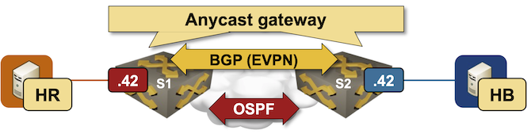

# EVPN Asymmetric Integrated Routing and Bridging (IRB)

This directory contains the *netlab* topology file for the

**[EVPN Asymmetric Integrated Routing and Bridging (IRB)](../../docs/evpn/4-asym-irb.md)** lab.

